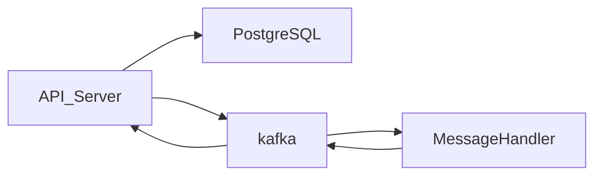

## Инструкция 

Для развертывания сервиса необходимо запустить скрипт build.sh,
который почистит докер от ранее запущенных контейнеров, если они были
и начнет процесс сборки Docker compose. Docker compose содержит PostgreSQL,
Zookeeper, kafka и два сервиса go 1 из который является апи сервером а второй - 
обработчиком сообщений (в данном случае он меняет ischecked на `true`)

## API Server routes

GET  `/`        данные о возможных запросах

GET  `/get`     получить сообщения из базы данных

GET  `/delete`  очистить таблицу `messages` внутри базы данных

POST `/insert`  вставить сообщение

## Структура микросервиса

